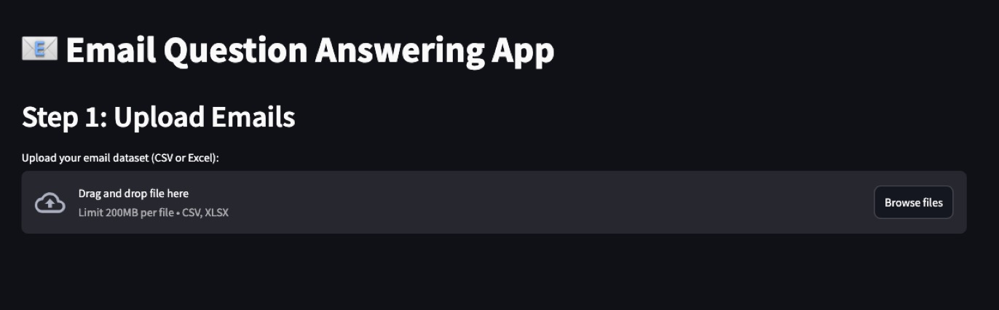
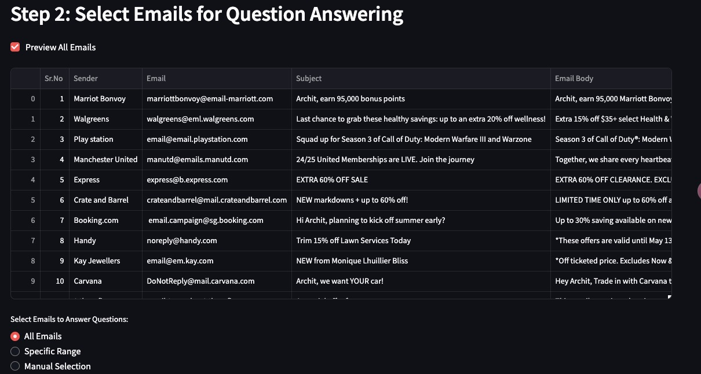
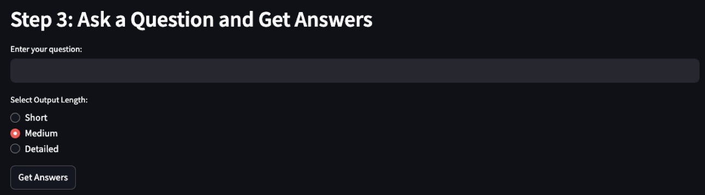

### README.md for Email Question Answering App

# Email Question Answering App

The **Email Question Answering App** is a web-based application designed to analyze email datasets and provide insightful responses using advanced language models (LLMs). Built with Python and Streamlit, this app allows users to upload email datasets, ask questions, and receive concise, medium, or detailed answers based on their preferences.

---

## Features

### 1. **Upload Emails**
   - Accepts datasets in `.csv` or `.xlsx` format.
   - Requires the column `Email Body` for processing.
   - Previews the uploaded emails for user validation.

### 2. **Email Selection**
   - Users can select:
     - **All Emails**
     - **Specific Range** of emails
     - **Manual Selection** based on indices.
   - Allows preview of the selected emails.

### 3. **Ask Questions**
   - Users can input a custom question to analyze the content of the emails.
   - Options to select output length:
     - **Short**
     - **Medium**
     - **Detailed**
   - Displays results directly with clear differentiation of email content and the generated answers.

---

## Installation

1. **Clone the Repository**
   ```bash
   git clone https://github.com/<your-username>/email_app.git
   cd email_app
   ```

2. **Install Dependencies**
   Ensure you have Python 3.8 or above installed. Install the required libraries:
   ```bash
   pip install -r requirements.txt
   ```

3. **Set Up OpenAI API Key**
   - Save your OpenAI API key in a file named `api_key.txt` in the root directory.

4. **Run the App**
   ```bash
   streamlit run app.py
   ```

---

## File Structure

```plaintext
email_app/
│
├── data/
│   └── Email_Marketing.xlsx        # Sample email dataset
│
├── output/                         # Folder for output files
│
├── utils/
│   └── question_answering.py       # Core logic for GPT-based question answering
│
├── app.py                          # Main Streamlit application file
├── api_key.txt                     # File containing OpenAI API key
├── requirements.txt                # Dependencies for the app
└── README.md                       # Documentation file
```

---

## Example Workflow

1. **Upload your dataset:**
   - Use the provided sample dataset `Email_Marketing.xlsx` or your own file.
2. **Select specific emails or ranges for analysis.**
3. **Ask questions:**
   - Examples:
     - *"What is this email about?"*
     - *"Does this email mention any promotional offers?"*
4. **View and download results:**
   - The app provides generated answers that can be saved as a `.csv` file.

---

## Screenshots

### 1. Upload Emails


### 2. Select Emails


### 3. Ask Questions


---

## Future Improvements

- **Integration with email providers:** Directly import emails from Gmail or Outlook.
- **Multi-language support:** Analyze emails in multiple languages.
- **Improved visualization:** Enhanced EDA features for better insights.

---

## Contributing

Contributions are welcome! Please follow the steps below:

1. Fork the repository.
2. Create a new branch.
3. Make your changes and commit them.
4. Push to your branch and submit a pull request.

---

## Contact

For any questions or feedback, please contact **Xiaoge Zhang** at **[yolanda101533@gmail.com]**.